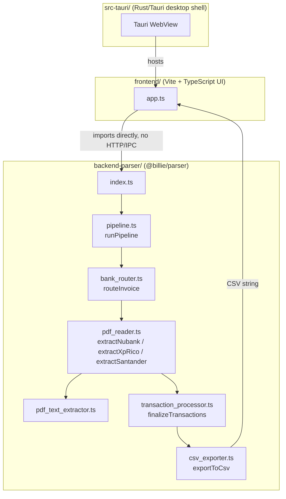

# Billie - Local Bank Statement Parser


**Billie** is an open-source, local-first tool that extracts transaction data from Brazilian bank/credit-card statement PDFs and exports it as a clean CSV file — date, merchant, and amount.

## 🛡️ Privacy First

Financial data is highly sensitive, and Billie was built from day one to respect your privacy:

* **100% Local:** Billie runs entirely on your machine. There are no backend servers, no accounts, and no network calls involved in processing your statement.
* **No Third Parties:** Your PDF never leaves your computer. Nothing is uploaded, synced, or sent anywhere.

---

## ✨ Features

* **📄 PDF Parsing:** Extracts transaction data from bank statements (currently supports Nubank, XP/Rico, and Santander).
* **🔒 Password-Protected PDFs:** Handles encrypted statement PDFs natively (via `pdfjs-dist`, no external tools needed).
* **📊 CSV Export:** Outputs a clean, semicolon-delimited CSV (date, merchant, amount) formatted for Brazilian locale conventions (Excel-friendly).
* **🔄 Smart Updater:** Built-in background checker that notifies you whenever a new release is available on GitHub.
* **💻 Minimal Interface:** A single-screen UI — select a PDF, fill in a couple of details, and process.

---

## 🛠️ How to Run (For Developers)

Billie is an npm workspace with two packages — `backend-parser` (parsing engine, `@billie/parser`) and `frontend` (the UI) — plus a `src-tauri/` project that wraps them into a native desktop app.

**1. Clone the repository:**
```bash
git clone https://github.com/eduardoteranisi/billie-project.git
cd billie-project
```

**2. Install dependencies (from the repo root):**
```bash
npm install
```

**3. Run in the browser (fastest for parser/UI iteration):**
```bash
cd frontend
npm run dev
```
Open the URL Vite prints in your browser.

**3b. Or run as a desktop app (Tauri):**
```bash
npm run tauri dev
```
This opens Billie in a native window instead of a browser tab.

---

## 🏗️ Architecture

Billie is an npm workspace with two JS packages plus a Rust/Tauri shell. `frontend` imports `@billie/parser` directly — there's no backend server or IPC hop involved in parsing.



Each bank gets its own extractor function in `pdf_reader.ts`, matched against a bank-specific regex in `bank_patterns.ts`. Adding a new bank means adding a pattern, an `extractX` function, and a case in the `bank_router.ts` switch.

---

## 📦 Releasing new versions (installers for Windows/Linux)

Installers are **not** built or committed manually — they're produced by CI and attached to a GitHub Release.

1. Bump `version` in `src-tauri/tauri.conf.json` and `CURRENT_VERSION` in `frontend/services/update_checker.ts` so they match.
2. Tag the commit and push the tag:
   ```bash
   git tag v0.1.0
   git push --tags
   ```
3. Pushing a `v*` tag triggers `.github/workflows/release.yml`, which builds Billie on both `windows-latest` and `ubuntu-latest` runners and uploads the installers (`.msi`/`.nsis` for Windows, `.deb`/`.AppImage` for Linux) as assets on a **draft** GitHub Release matching the tag.
4. Go to the repo's [Releases page](https://github.com/eduardoteranisi/billie-project/releases), review the draft, edit the notes if needed, and click **Publish release**. Only then do testers see it — the update checker in the app also relies on the release being published, not just drafted.
5. Testers download the installer for their OS directly from that Releases page — no site, no account, no upload.

---

## 📝 Naming Conventions

To keep the codebase consistent, follow these conventions when adding folders, files, functions, variables, or constants:

* **Folders** → all lowercase, words separated only by `-` (e.g. `backend-parser`)
* **Files** → all lowercase, snake_case (e.g. `pdf_reader.ts`)
* **Functions** → all lowercase, camelCase (e.g. `runPipeline`)
* **Variables** → all lowercase, camelCase (e.g. `pdfBytes`)
* **Constants** → SCREAMING_CASE (e.g. `CURRENT_VERSION`)

---

## 🤝 Contributing
Pull requests are welcome! If you want to add support for a new bank's PDF format, feel free to open an issue or submit a PR. Please follow the [naming conventions](#-naming-conventions) above.

## 📄 License
This project is licensed under the MIT License - see the LICENSE file for details.

Developed by [Eduardo Teranisi](https://github.com/eduardoteranisi).
